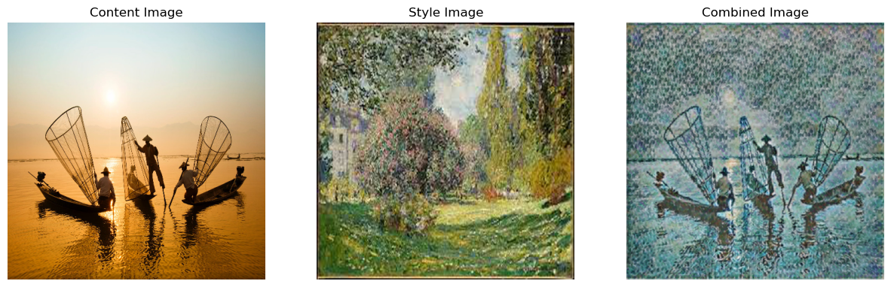
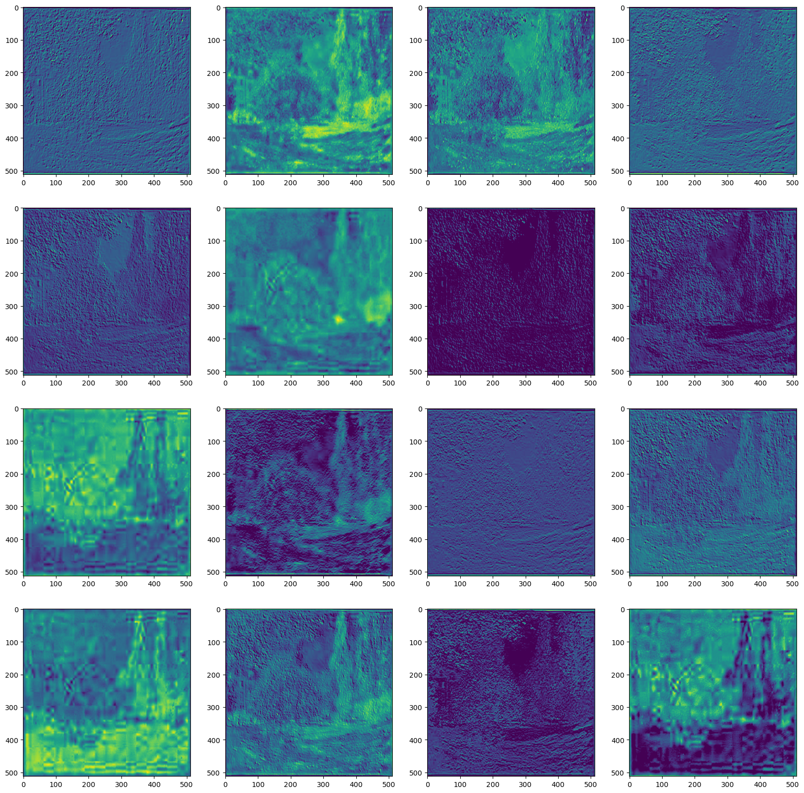
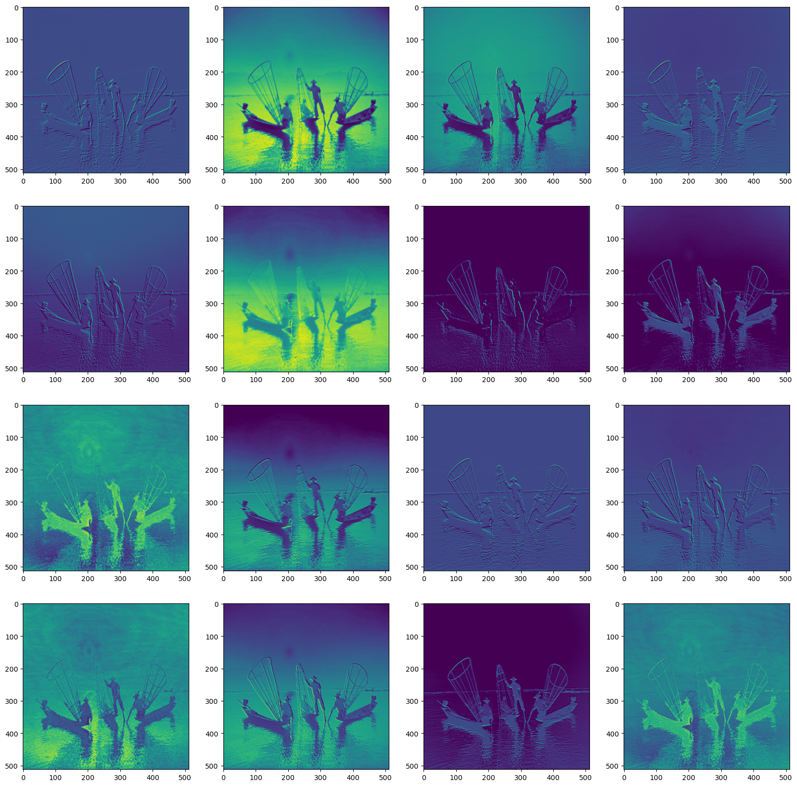
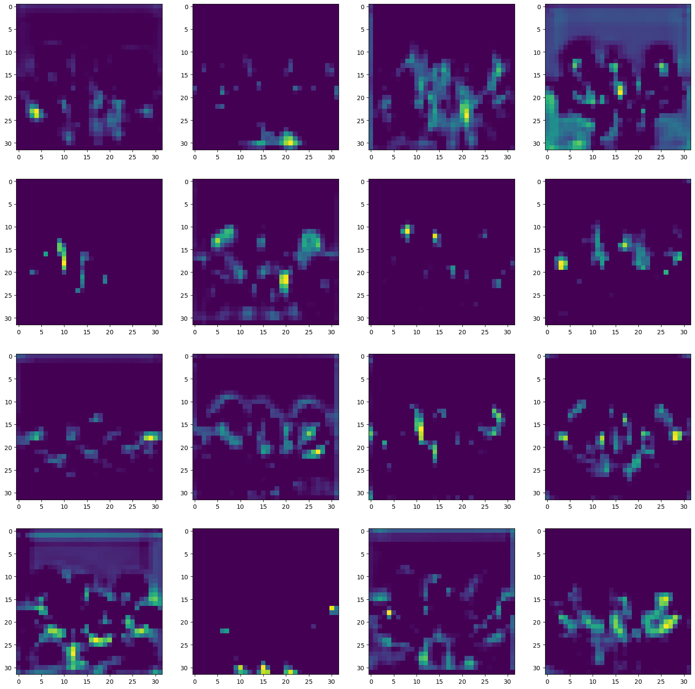
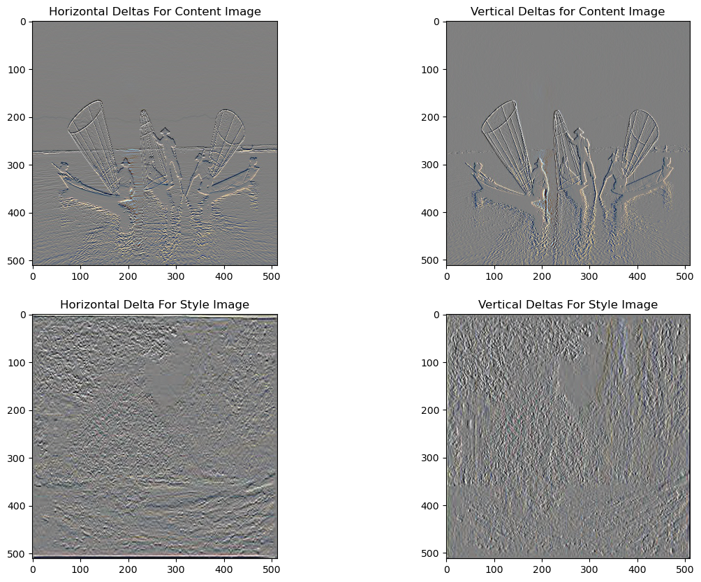

```python
import tensorflow as tf
import cv2
import numpy as np
import time
import wandb

import matplotlib.pyplot as plt
import IPython.display as display
import PIL.Image

from os import path, sep
from tensorflow.keras.models import Model

```


```python
def tensor_to_img(tensor):
    tensor = tensor*255
    tensor = np.array(tensor, dtype=np.uint8)
    if np.ndim(tensor)>3:
        assert tensor.shape[0] == 1
        tensor = tensor[0]
    return PIL.Image.fromarray(tensor)
```


```python
def img_to_tensor(path_to_img):
    max_dim = 512
    img = tf.io.read_file(path_to_img)
    img = tf.image.decode_image(img, channels=3)
    img = tf.image.convert_image_dtype(img, tf.float32)

    shape = tf.cast(tf.shape(img)[:-1], tf.float32)
    long_dim = max(shape)
    scale = max_dim / long_dim

    new_shape = tf.cast(shape * scale, tf.int32)

    img = tf.image.resize(img, new_shape)
    img = img[tf.newaxis, :]
    return img

```


```python
def imshow(content_img, style_img, combined_image):
    plt.figure(figsize=[15,15])
    plt.subplot(131);plt.imshow(content_img[:,:,::-1]);plt.title("Content Image");plt.axis('off');
    plt.subplot(132);plt.imshow(style_img[:,:,::-1]);plt.title("Style Image");plt.axis('off');
    plt.subplot(133);plt.imshow(combined_image[:,:,::-1]);plt.title("Combined Image");plt.axis('off');

```


```python
def _resize_save(path_to_img):
    image = cv2.imread(path_to_img)
    image = cv2.resize(image, (512, 512), interpolation=cv2.INTER_CUBIC)
    normalized_path = path.normpath(path_to_img)
    path_components = normalized_path.split(sep)
    cv2.imwrite(f"../{path_components[1]}/interim/{path_components[3]}/{path_components[-1]}",  image)

    return image


content_image = _resize_save('../data/external/content/landscape2.jpeg')
style_image = _resize_save('../data/external/style/monet1.jpeg')

```


```python
# Let's check some samples
import tensorflow_hub as hub
content_tf_img = img_to_tensor('../data/interim/content/landscape2.jpeg')
style_tf_img = img_to_tensor('../data/interim/style/monet1.jpeg')
hub_model = hub.load('https://tfhub.dev/google/magenta/arbitrary-image-stylization-v1-256/2')
combined_img_fast = hub_model(tf.constant(content_tf_img), tf.constant(style_tf_img))[0]
combined_img_fast = tensor_to_img(combined_img_fast)


imshow(content_image, style_image, combined_img_fast)
```

    2023-01-14 15:05:11.370512: I tensorflow/core/grappler/optimizers/custom_graph_optimizer_registry.cc:114] Plugin optimizer for device_type GPU is enabled.


    

    


**Content and Style Representations**


```python
x = tf.keras.applications.vgg19.preprocess_input(content_tf_img*255)
x = tf.image.resize(x, (224, 224))
vgg = tf.keras.applications.VGG19(include_top=True, weights='imagenet')
prediction_probabilities = vgg(x)
prediction_probabilities.shape
predicted_top_5 = tf.keras.applications.vgg19.decode_predictions(prediction_probabilities.numpy())[0]
[(class_name, prob) for (number, class_name, prob) in predicted_top_5]
```


    [('wreck', 0.5972981),
     ('crane', 0.09216407),
     ('pirate', 0.058110025),
     ('dragonfly', 0.0276397),
     ('radio_telescope', 0.021660376)]


Now load a VGG19 without the classification head, and list the layer names


```python
vgg = tf.keras.applications.VGG19(include_top=False, weights='imagenet')
for idx, layer in enumerate(vgg.layers):
    print(f"{idx} - {layer.name}")
```

    0 - input_2
    1 - block1_conv1
    2 - block1_conv2
    3 - block1_pool
    4 - block2_conv1
    5 - block2_conv2
    6 - block2_pool
    7 - block3_conv1
    8 - block3_conv2
    9 - block3_conv3
    10 - block3_conv4
    11 - block3_pool
    12 - block4_conv1
    13 - block4_conv2
    14 - block4_conv3
    15 - block4_conv4
    16 - block4_pool
    17 - block5_conv1
    18 - block5_conv2
    19 - block5_conv3
    20 - block5_conv4
    21 - block5_pool


Lets visualize the feature maps from the image


```python
def show_feature_maps(activation):
    plt.figure(figsize=(20,20))
    for i in range(16):
        plt.subplot(4,4,i+1)
        plt.imshow(activation[0,:,:,i])
    plt.show()
```

Visualization for the first layer of style image features.


```python
activation_model = Model(inputs=vgg.inputs, outputs=vgg.layers[1].output)
activation = activation_model(style_tf_img)
show_feature_maps(activation)
```


    

    


Visualization for the first layer of content image features.


```python
activation_model = Model(inputs=vgg.inputs, outputs=vgg.layers[1].output)
activation = activation_model(content_tf_img)
show_feature_maps(activation)
```


    

    


```python
activation_model = Model(inputs=vgg.inputs, outputs=vgg.layers[18].output)
activation = activation_model(content_tf_img)
show_feature_maps(activation)
```


    

    


**Build the model**


```python
def vgg_layers(layer_names):
    """ Creates a VGG model that returns a list of intermediate output values."""
    vgg = tf.keras.applications.VGG19(include_top=False, weights='imagenet')
    vgg.trainable = False

    outputs = [vgg.get_layer(name).output for name in layer_names]

    model = tf.keras.Model([vgg.input], outputs)
    return model
```

### Extract style and content
In this section, we build a model that returns the style and content tensors.

As we all know, CNN's take the raw image as input and coverts these raw pixels into a complex understanding of feature maps of a image. For example, in the first layer,the network tries to learn detecting horizontal, vertical or diagonal lines. And Detecting corners in the second layer. While moving deeper into the network, we can observe that these features hold more complexnd abstract representation of the image.

That's why, for the **content extraction**, we are more interested in the **final block of the model**, as it represents more abstract features of the image.

However, for the **style extraction**, each layer network detects some of the other patterns. Therefore, we should use **one layer from each block** to extract the style information.


```python
content_layers = ['block5_conv2']
style_layers =['block1_conv1','block2_conv1','block3_conv1','block4_conv1','block5_conv1']

```


```python
style_extractor = vgg_layers(style_layers)
style_outputs = style_extractor(style_tf_img*255)

# Some statistics of each layer's output
for name, output in zip(style_layers, style_outputs):
    print(name)
    print("  shape: ", output.numpy().shape)
    print("  min: ", output.numpy().min())
    print("  max: ", output.numpy().max())
    print("  mean: ", output.numpy().mean())
    print()
```

    block1_conv1
      shape:  (1, 512, 512, 64)
      min:  0.0
      max:  790.3741
      mean:  28.563719
    
    block2_conv1
      shape:  (1, 256, 256, 128)
      min:  0.0
      max:  3122.498
      mean:  163.09653
    
    block3_conv1
      shape:  (1, 128, 128, 256)
      min:  0.0
      max:  6652.75
      mean:  148.51855
    
    block4_conv1
      shape:  (1, 64, 64, 512)
      min:  0.0
      max:  12907.435
      mean:  534.4656
    
    block5_conv1
      shape:  (1, 32, 32, 512)
      min:  0.0
      max:  1964.4834
      mean:  32.186527
    


```python
def gram_matrix(input_tensor):
    result = tf.linalg.einsum('bijc,bijd->bcd', input_tensor, input_tensor)
    input_shape = tf.shape(input_tensor)
    num_locations = tf.cast(input_shape[1]*input_shape[2], tf.float32)
    return result/(num_locations)
```


```python
class Style2ContentModel(tf.keras.models.Model):
    def __init__(self, style_layers, content_layers):
        super(Style2ContentModel, self).__init__()
        self.vgg = vgg_layers(style_layers + content_layers)
        self.style_layers = style_layers
        self.content_layers = content_layers
        self.num_style_layers = len(style_layers)
        self.vgg.trainable = False

    def call(self, inputs):
        "Expects float input in [0,1]"
        inputs = inputs*255.0
        preprocessed_input = tf.keras.applications.vgg19.preprocess_input(inputs)
        outputs = self.vgg(preprocessed_input)
        style_outputs, content_outputs = (outputs[:self.num_style_layers],
                                          outputs[self.num_style_layers:])

        style_outputs = [gram_matrix(style_output)
                         for style_output in style_outputs]

        content_dict = {content_name: value
                        for content_name, value
                        in zip(self.content_layers, content_outputs)}

        style_dict = {style_name: value
                      for style_name, value
                      in zip(self.style_layers, style_outputs)}

        return {'content': content_dict, 'style': style_dict}
```


```python
extractor = Style2ContentModel(style_layers, content_layers)
results = extractor(tf.constant(content_tf_img))
```

**Run gradient descent**


```python
style_targets = extractor(style_tf_img)['style']
content_targets = extractor(content_tf_img)['content']
```

Since this is a float image, define a function to keep the pixel values between 0 and 1:


```python
def clip_0_1(image):
    return tf.clip_by_value(image, clip_value_min=0.0, clip_value_max=1.0)

```

**Total variation loss**


```python
def high_pass_x_y(image):
    x_var = image[:,:,1:,:] - image[:,:,:-1,:]
    y_var = image[:,1:,:,:] - image[:,:-1,:,:]
    return x_var, y_var
```


```python
x_deltas, y_deltas = high_pass_x_y(content_tf_img)

def _show_img(image, title):
    if len(image.shape) > 3:
        image = tf.squeeze(image, axis=0)
    plt.title(title)
    plt.imshow(image)


plt.figure(figsize=(14, 10))
plt.subplot(2, 2, 1)
_show_img(clip_0_1(2*y_deltas+0.5), "Horizontal Deltas For Content Image")

plt.subplot(2, 2, 2)
_show_img(clip_0_1(2*x_deltas+0.5), "Vertical Deltas for Content Image")

x_deltas, y_deltas = high_pass_x_y(style_tf_img)

plt.subplot(2, 2, 3)
_show_img(clip_0_1(2*y_deltas+0.5), "Horizontal Delta For Style Image")

plt.subplot(2, 2, 4)
_show_img(clip_0_1(2*x_deltas+0.5), "Vertical Deltas For Style Image")
```


    

    


```python
def total_variation_loss(image):
    x_deltas, y_deltas = high_pass_x_y(image)
    return tf.reduce_sum(tf.abs(x_deltas)) + tf.reduce_sum(tf.abs(y_deltas))
```


```python
style_weight=1e-2
content_weight=1e4
total_variation_weight=30

image = tf.Variable(content_tf_img)
opt = tf.keras.optimizers.Adam(learning_rate=0.02, beta_1=0.99, epsilon=1e-1)
```

For optimization, we can use a weighted combination of the two losses to get the total loss.


```python
def style_content_loss(outputs):
    style_outputs = outputs['style']
    content_outputs = outputs['content']
    style_loss = tf.add_n([tf.reduce_mean((style_outputs[name]-style_targets[name])**2) 
                           for name in style_outputs.keys()])
    style_loss *= style_weight / len(style_layers)

    content_loss = tf.add_n([tf.reduce_mean((content_outputs[name]-content_targets[name])**2) 
                             for name in content_outputs.keys()])
    content_loss *= content_weight / len(content_layers)
    loss = style_loss + content_loss
    return loss
```

**Train**


```python
@tf.function()
def train_step(image):
    with tf.GradientTape() as tape:
        outputs = extractor(image)
        loss = style_content_loss(outputs)
        loss += total_variation_weight*tf.image.total_variation(image)
    grad = tape.gradient(loss, image)
    opt.apply_gradients([(grad, image)])
    image.assign(clip_0_1(image))
```


```python
start = time.time()

epochs = 10
steps_per_epoch = 100

step = 0
for n in range(epochs):
    for m in range(steps_per_epoch):
        step += 1
        train_step(image)
        print(".", end='', flush=True)
    display.clear_output(wait=True)
    display.display(tensor_to_img(image))
    print("Train step: {}".format(step))

end = time.time()
print("Total time: {:.1f}".format(end-start))
```


    

    


    Train step: 1000
    Total time: 339.1

